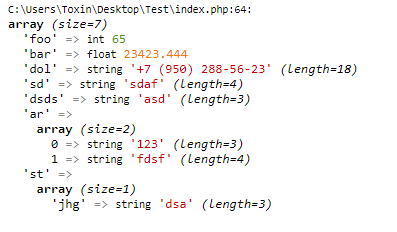
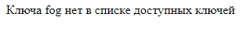
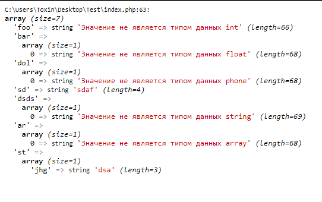

# Sanitizer
По умолчанию есть 7 настройных типов данных, которые сервер может обработать:

* array - одномерный массив
* float - число с плавающей запятой
* int - целочисленный типа
* phone - номер телефона российской федерации
* string - строковый тип
* structure - ассоциативный массив

Пример валидации и нормализации приходящих данных:
~~~
        $filters = [
            'foo' => 'int',
            'bar' => 'float',
            'dol' => 'phone',
            'sd' => 'string',
            'dsds' => 'string',
            'ar'=> 'Array',
            'st'=> 'Structure'
        ];
~~~
Обозначем у каких ключей какие типы данных

~~~
        $json = json_encode([
            'foo' => '65',
            'bar' => '23423.444',
            'dol' => '+7 (950) 288-56-23',
            'sd' => 'sdaf',
            'dsds'=> 'asd',
            'ar' =>
                ["123", "fdsf"],
            'st' => [
                'jhg'=>'dsa' ]
        ]);
~~~
Приходящие данные в виде json формата

~~~
$result = $sanitizer->sanitize($filters, $json);
~~~
Обрабатываем эти два массива через метод sanitize, который проверяет чтобы совпадали названия ключей, тип поступаемых данных был таким, каким его указали для этого ключа.
~~~
class FinalTest
{
    public function testing()
    {
        $sanitizer = new Sanitizer();
        $filters = [
            'foo' => 'int',
            'bar' => 'float',
            'dol' => 'phone',
            'sd' => 'string',
            'dsds' => 'string',
            'ar'=> 'Array',
            'st'=> 'Structure'
        ];
        $json = json_encode([
            'foo' => '65',
            'bar' => '23423.444',
            'dol' => '+7 (950) 288-56-23',
            'sd' => 'sdaf',
            'dsds'=> 'asd',
            'ar' =>
                ["123", "fdsf"],
            'st' => [
                'jhg'=>'dsa'
    ]
        ]);

        $result = $sanitizer->sanitize($filters, $json);
    var_dump($result);
    }
}
$ds=new FinalTest();
$ds->testing();
~~~
Полный код.

Что выведет, если тип поступивших данных был правильным.

Давайте попробуем передать ключ, которого нет в заданных.
~~~
        $json = json_encode([
            'foo' => '65',
            'bar' => '23423.444',
            'dol' => '+7 (950) 288-56-23',
            'sd' => 'sdaf',
            'dsds'=> 'asd',
            'ar' =>
                ["123", "fdsf"],
            'st' => [
                'jhg'=>'dsa'
    ],
            'fog'=>'34'
        ]);
~~~

Попробуем передать не верный тип данных.
~~~
       $json = json_encode([
            'foo' => '65.43',
            'bar' => '23423fd44',
            'dol' => '+9 56-23',
            'sd' => 'sdaf',
            'dsds'=> 543,
            'ar' => 'array',
            'st' => [
                'jhg'=>'dsa'
    ]
        ]);
~~~

